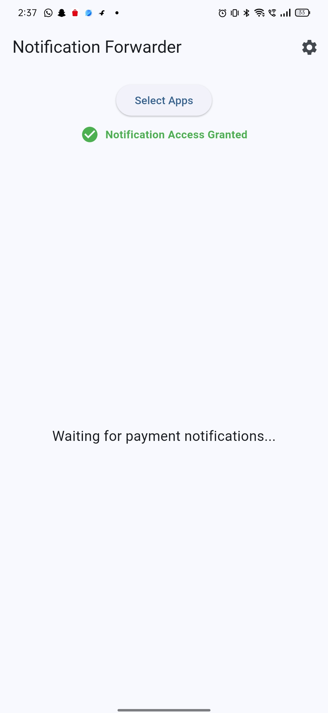
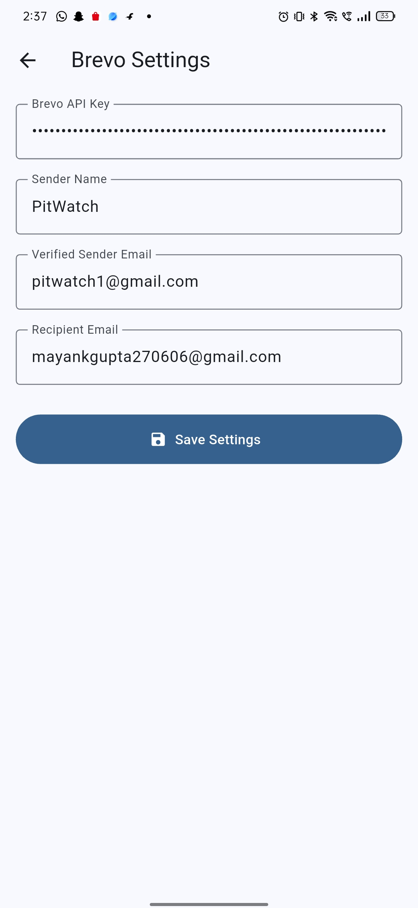
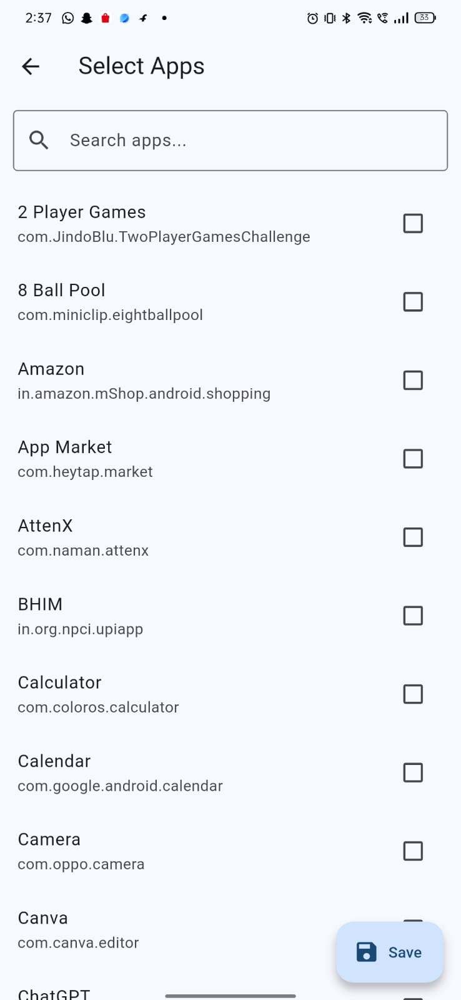
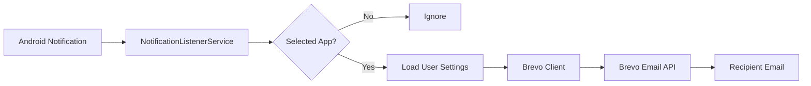
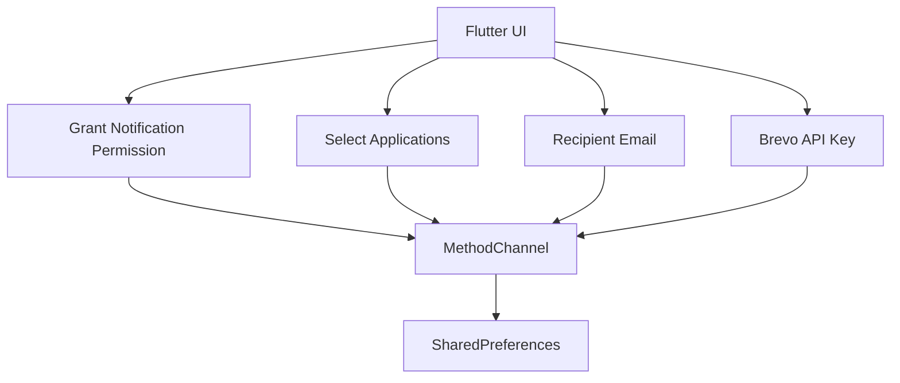
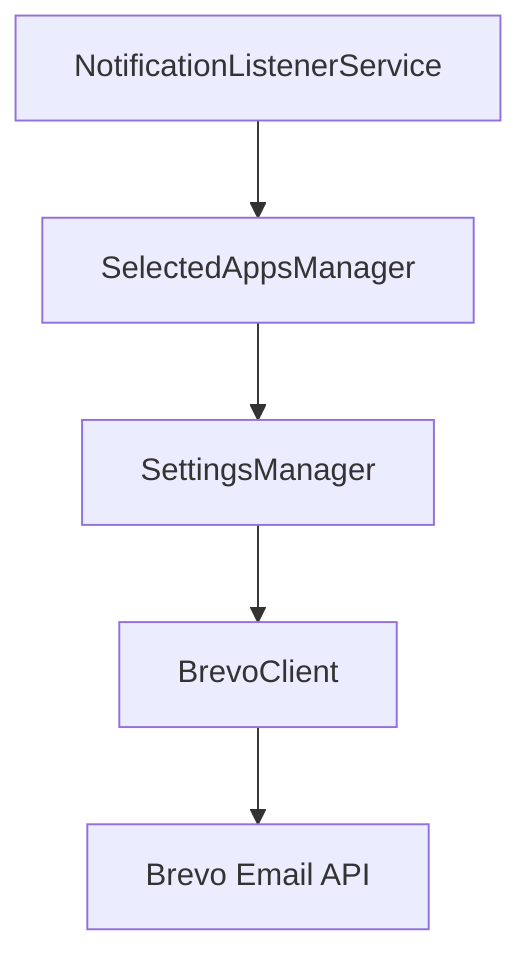
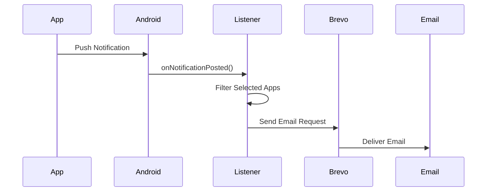
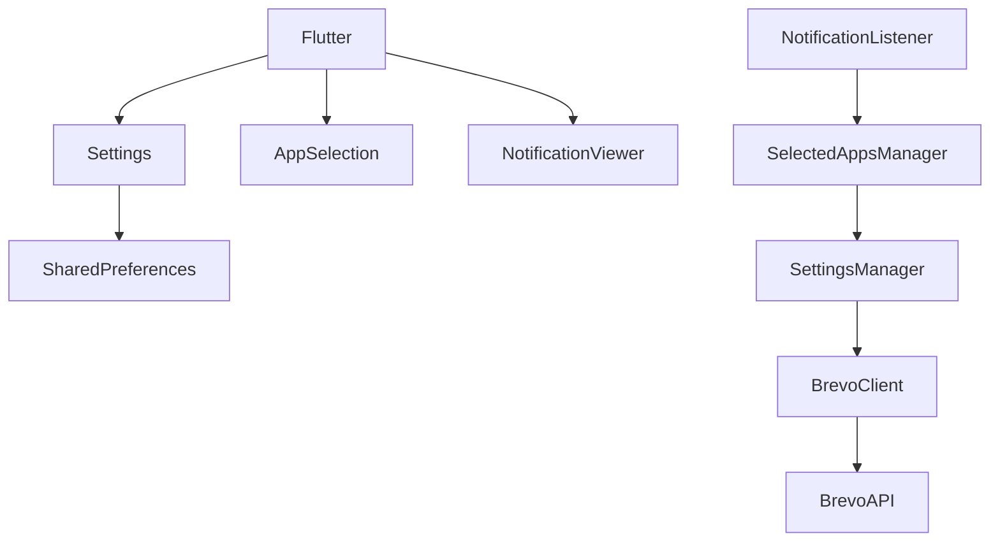

# 📩 Notification Forwarder

<p align="center">


</p>

---

## Overview

**Notification Forwarder** is an Android application that securely forwards notifications from user-selected applications directly to email using the **Brevo Email API**.

Unlike traditional notification forwarding applications, **no backend server is required**.

All notification processing, filtering and email forwarding are performed locally on the Android device using **NotificationListenerService**.

The Flutter application acts only as the configuration interface while all background forwarding is handled natively in Kotlin.

---

# Features

- Native Android Notification Listener
- Works while application is in background
- User selectable applications
- Direct Brevo Email API integration
- No backend server required
- Native Kotlin implementation
- Flutter based configuration UI
- Secure API Key storage
- Recipient Email configuration
- SharedPreferences based settings
- Live Notification Monitor
- Material 3 UI
- Fast & Lightweight

---

# Screenshots

<h2>Screenshots</h2>

<p align="center">
  
  
  
</p>

---

# Architecture

## Overall System



---

## Flutter Architecture



---

## Native Android Architecture



---

## Notification Flow



---

## Application Structure



---

# Folder Structure

```text
notification_forwarder/

│
├── android/
│   │
│   ├── api/
│   │     └── BrevoClient.kt
│   │
│   ├── apps/
│   │     └── InstalledAppsProvider.kt
│   │
│   ├── channel/
│   │     └── NotificationStreamHandler.kt
│   │
│   ├── listener/
│   │     └── NotificationListener.kt
│   │
│   ├── model/
│   │     └── NotificationData.kt
│   │
│   ├── permission/
│   │     └── PermissionHelper.kt
│   │
│   ├── storage/
│   │     ├── SettingsManager.kt
│   │     └── SelectedAppsManager.kt
│   │
│   ├── utils/
│   │     ├── AppNameResolver.kt
│   │     ├── Constants.kt
│   │     └── ...
│   │
│   └── MainActivity.kt
│
├── lib/
│   │
│   ├── models/
│   │
│   ├── screens/
│   │     ├── HomeScreen.dart
│   │     ├── SettingsScreen.dart
│   │     └── AppSelectionScreen.dart
│   │
│   ├── services/
│   │
│   ├── widgets/
│   │
│   └── main.dart
│
├── pubspec.yaml
│
└── README.md
```

---

# Technology Stack

## Frontend

- Flutter
- Dart
- Material 3

---

## Native Android

- Kotlin
- NotificationListenerService
- SharedPreferences
- MethodChannel
- EventChannel
- OkHttp

---

## Email

- Brevo Email API

---

# How It Works

1. User installs the application.

2. Grants Notification Access.

3. Selects applications whose notifications should be forwarded.

4. Enters:

   - Recipient Email
   - Brevo API Key

5. Configuration is securely stored using SharedPreferences.

6. Android NotificationListenerService listens for incoming notifications.

7. Selected applications are filtered.

8. Notification data is sent directly to Brevo.

9. Brevo delivers the email to the configured recipient.

---

# Notification Payload

```json
{
    "email":"recipient@example.com",
    "app":"WhatsApp",
    "title":"John Doe",
    "message":"Hello!"
}
```

---

# Configuration

## Recipient Email

Used as destination email for forwarded notifications.

---

## Brevo API Key

Generate your API key from:

https://app.brevo.com/

The API Key is stored locally on the device.

---

# Permissions

The application requires:

- Notification Access
- Internet Permission
- Query Installed Applications

---

# Security

✔ No backend server

✔ No notification database

✔ Direct communication with Brevo

✔ User API Key never passes through any third-party server

✔ Local SharedPreferences storage

---

# Build

Clone repository

```bash
git clone https://github.com/yourusername/notification-forwarder.git
```

Open project

```bash
cd notification-forwarder
```

Install packages

```bash
flutter pub get
```

Run

```bash
flutter run
```

Release APK

```bash
flutter build apk --release
```

---

# Future Improvements

- Notification History Database
- Retry Queue for Offline Notifications
- Export Logs
- Dark Theme
- Search Applications
- Multiple Recipient Emails
- Custom Email Templates
- Notification Categories
- WorkManager Retry Support
- Backup & Restore Settings
- Notification Analytics
- Cloud Synchronization
- Encryption for Stored Credentials
- Material You Support

---

# Why This Project?

Most notification forwarding applications rely on their own backend servers.

This project removes that dependency entirely.

The Android application communicates **directly with Brevo**, making the architecture:

- Faster
- More secure
- Easier to deploy
- Easier to maintain
- Cheaper to operate

---

# License

MIT License

---

# Author

**Mayank Gupta**

Full Stack Developer

- Flutter
- Kotlin
- FastAPI
- Django
- Next.js
- PostgreSQL
- Android Development

---

## Star the Repository

If you found this project useful, consider giving it a ⭐ on GitHub.